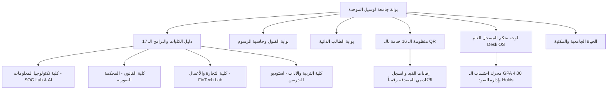

# 🏛️ Lusail University OS (2026/2027)
### منظومة تشغيل جامعة لوسيل الرقمية الموحدة | البوابة الأكاديمية والأنظمة الذكية

<div align="center">


[](https://lu.edu.qa)
[](https://lu.edu.qa)
[](portal/index.html)
[](portal/colleges.html)
[](portal/services.html)
[](portal/about.html)

**المقترح التنفيذي الرسمي المعتمد للتحول الرقمي الأكاديمي الشامل لجامعة لوسيل (دولة قطر)**
*متوافق مع ركيزة التنمية البشرية وفق رؤية قطر الوطنية 2030*

[استعراض البوابة (Live Portal)](portal/index.html) • [العرض التقديمي الفاخر](presentation/render_slides.html) • [تحميل الباوربوينت (.pptx)](presentation/Lusail_University_Master_Pitch.pptx) • [شيت البيانات الأكاديمية](client_deliverables/Lusail_University_Academic_Programs_Data.csv)

</div>

---

## 🌟 نظرة عامة على المشروع (Project Overview)

مشروع **Lusail University OS** هو منصة رقمية سيادية موحدة تم تطويرها خصيصاً لإدارة وكليات وطلبة **جامعة لوسيل**، بهدف توحيد كافة الخدمات والأنظمة الأكاديمية تحت مظلة واحدة بهوية مؤسسية أصيلة 100% (الكحلي الملكي `#004876` والذهبي اللوسيلي الدافئ `#be9c79`)، مع ربط كامل لـ 21 صفحة تخصصية وأتمتة 16 خدمة ذاتية بالختم الرقمي والتحقق بالـ QR Code.

### 🏛️ القيادة المؤسسية المعتمدة:
* **رئيس مجلس الأمناء:** سعادة الدكتور علي بن فطيس المري
* **رئيس الجامعة:** الأستاذ الدكتور نظام هندي

---

## 🎯 المكونات الرئيسية للمنظومة (Core Ecosystem)



---

## 📚 الكليات الأكاديمية والبرامج الـ 17 المعتمدة

| الكلية | اللون المؤسسي | أبرز البرامج والمسارات الأكاديمية | المرافق التطبيقية الذكية |
| :--- | :---: | :--- | :--- |
| **كلية تكنولوجيا المعلومات** | `#5F1259` | الذكاء الاصطناعي، الأمن السيبراني، علوم البيانات، تقنية المعلومات | مختبر العمليات السيبرانية SOC |
| **كلية القانون** | `#49AA76` | القانون العام، القانون الخاص، الدراسات المقارنة، ماجستير القانون الدولي | المحكمة الصورية والعيادة القانونية |
| **كلية التجارة والأعمال** | `#962D3F` | إدارة الأعمال، المحاسبة والمالية، التسويق الرقمي، سلاسل الإمداد | معمل المحاكاة المالية FinTech Lab |
| **كلية التربية والآداب** | `#003B4D` | تدريس اللغة الإنجليزية، اللغة العربية والإعلام، العلوم التربوية | استوديو التدريس المصغر والصوتيات |

---

## ⚡ منظومة الـ 16 خدمة ذاتية المؤتمتة بالـ QR Code

تتيح المنظومة للطلبة استخراج ومتابعة 16 خدمة أكاديمية وإدارية فورياً بختم رقمي مشفر ورمز QR للتحقق المباشر:

1. **إفادة قيد رسمي معتمد**
2. **كشف درجات وسجل أكاديمي موثق**
3. **طلب تأجيل الفصل الدراسي**
4. **طلب إعادة رصد وتدقيق الدرجة**
5. **طلب تغيير التخصص الأكاديمي**
6. **طلب معادلة مساقات سابقة**
7. **حجز قاعات بحث المكتبة المركزية**
8. **إفادة حسن سيرة وسلوك**
9. **طلب بدل فاقد بطاقة جامعية**
10. **طلب تسجيل مساق إضافي**
11. **خطاب رسمي لمن يهمه الأمر للسفارات والجهات الحكومية**
12. **طلب إخلاء طرف للتخرج**
13. **طلب منحة التفوق الأكاديمي (50% و 100%)**
14. **طلب تدريب ميداني مهني**
15. **الانضمام للأندية والأنشطة الطلابية (12 نادياً)**
16. **اشتراكات وعضويات أندية اللياقة البدنية (Strive & Perf Up)**

---

## 📊 العرض التقديمي التنفيذي (Executive Pitch Deck & PowerPoint)

تم تضمين حزمة عرض متكاملة ومخصصة لمجلس الأمناء:
* **العرض التقديمي الفاخر (Web Edition):** [`presentation/render_slides.html`](presentation/render_slides.html)
* **ملف الباوربوينت المعتمد بجودة 1080p (.pptx):** [`presentation/Lusail_University_Master_Pitch.pptx`](presentation/Lusail_University_Master_Pitch.pptx)
* **الملخص التنفيذي المكتوب:** [`presentation/EXECUTIVE_PITCH_DECK.md`](presentation/EXECUTIVE_PITCH_DECK.md)

---

## 🛠️ دليل التشغيل السريع محلياً (Local Quickstart)

### 1. المتطلبات:
* متصفح حديث (Chrome / Edge / Firefox)
* Python 3.9+ (اختياري لتشغيل الـ Backend وسكربتات توليد الباوربوينت)

### 2. تشغيل البوابة الأكاديمية:
```bash
# تشغيل خادم محلي خفيف
python -m http.server 8085 --directory portal
```
ثم افتح المتصفح على: `http://localhost:8085`

### 3. تشغيل الخادم البرمجي (Backend API):
```bash
cd backend
pip install -r requirements.txt
uvicorn app.main:app --reload --port 8000
```
وثائق الـ API التفاعلية (Swagger UI): `http://localhost:8000/docs`

---

## 📁 هيكل المستودع (Repository Tree)

```text
├── portal/                 # واجهات البوابة الـ 21 والملاحة الموحدة
├── presentation/           # العرض التقديمي الفاخر وملفات الباوربوينت
├── backend/                # محرك الـ GPA والخدمات البرمجية (FastAPI)
├── client_deliverables/    # ملفات البيانات المعتمدة لجامعة لوسيل (CSV / HTML)
├── scripts/                # سكربتات التدقيق والأتمتة
├── docker-compose.yml      # إعدادات الحاويات السحابية
└── README.md               # هذا التوثيق الرسمي
```

---

<div align="center">

**جامعة لوسيل - صرح أكاديمي رائد في مدينة لوسيل، دولة قطر**  
*جميع الحقوق محفوظة لمنظومة Lusail University OS © 2026/2027*

</div>
